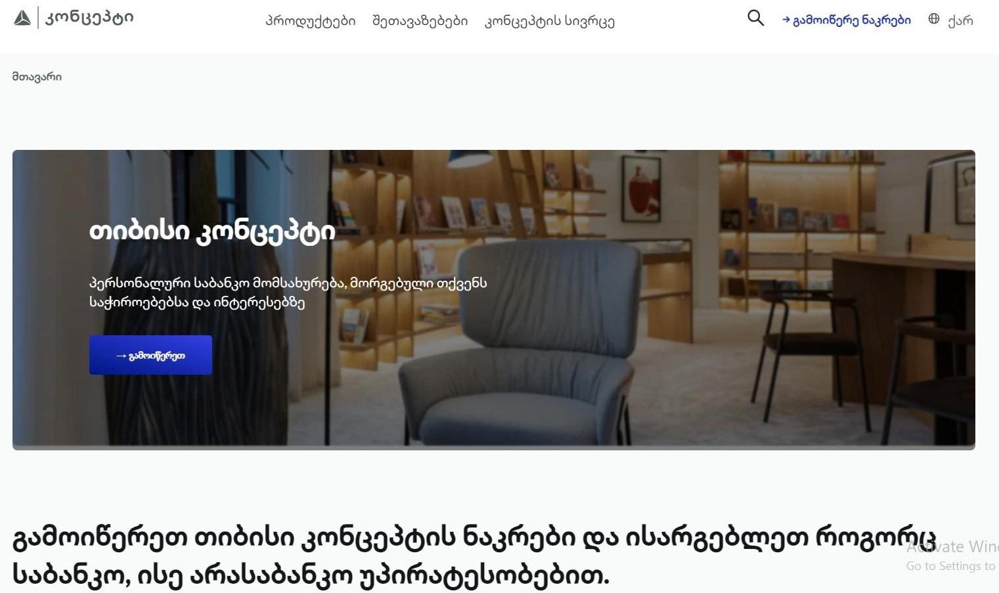

# TBC Concept

## Description

This project is a modern web application designed with a responsive layout and interactive features. It incorporates smooth scrolling containers, draggable elements, and various dynamic visual effects, optimized for both desktop and mobile devices.

## Screenshot



## Technologies Used

- **HTML5**: Provides the structure and content of the web pages.
- **CSS3**: Used for styling and layout, including media queries for responsive design.
  - **Custom Fonts**: `TBCXRegular`, `TBCXMedium`, and `TBCXBold`.
  - **Flexbox**: For layout alignment and spacing.
  - **CSS Transitions**: For smooth hover and scroll effects.
- **JavaScript**: Enhances interactivity with features like draggable lines and scroll buttons.
  - **Smooth Scrolling**: Implements smooth transitions for horizontal scrolling.
  - **Event Handling**: Manages user interactions with scroll buttons and draggable elements.

## Getting Started

To get started with this project, follow these steps:

### Prerequisites

- A modern web browser (e.g., Chrome, Firefox, Safari)
- Basic understanding of HTML, CSS, and JavaScript

### Installation

1. **Clone the Repository**

   Open your terminal and run the following command to clone the repository:

   ```bash
   git clone https://github.com/anano303/TBC.git
   cd TBC
   ```

### Open the Project

Open index.html in your web browser to view the project:

```bash

open index.html
```

### Project Structure

The project directory contains the following structure:

```plaintext

/project-root
│
├── /Fonts
│ ├── TBCXRegular.dee156cc.woff2
│ ├── TBCXMedium.8ef1248a.woff2
│ └── TBCXBold.6db5e61d.woff2
│
├── /images
│   ├── image1.png
│   ├── image2.png
│   └── image3.png
├── index.html
├── styles.css
└── script.js
```

- /Fonts: Contains custom font files.
- /images: Directory for image assets.
- index.html: Main HTML file.
- styles.css: Contains all the CSS styles.
- script.js: Contains JavaScript functionality for interactivity.

### Usage

- Desktop View: Includes a fixed header, interactive sections, and a footer.
- Mobile View: Features a responsive design with a collapsible menu and adjusted layouts.

### Contributing

To contribute to this project:

1. Fork the repository on GitHub
2. Create a new branch for your changes.
3. Commit your changes and push them to your forked repository.
4. Submit a pull request with a description of your changes.

### License

This project is licensed under the MIT License. See the LICENSE file for more details
